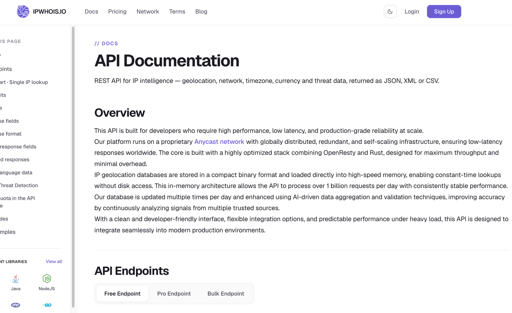
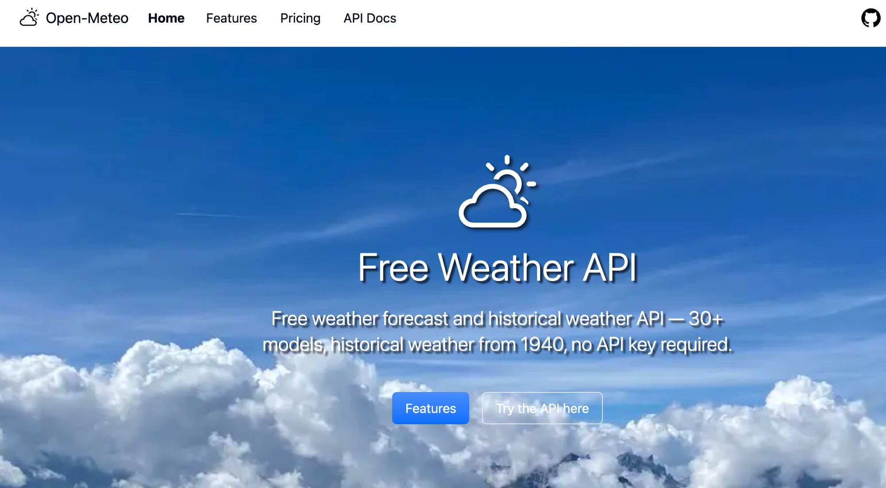
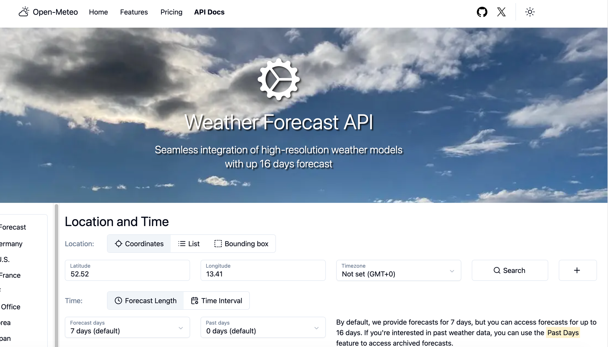

# 핸즈온 6 - Weather Axios

[← README로 돌아가기](../README.md)

경로: `/handson/weather-axios`

## 과제 요구사항

▪ Axios 활용 준비
1. Axios 라이브러리 설치
2. OpenWeatherMap API 가입 및 Key 발급

▪ 과제 요구사항
1. OpenWeatherMap API를 통해 실제 날씨 데이터를 가져와 적용한다.
2. OpenWeatherMap에서 제공되는 API를 추가하여 Application 기능을 확장한다.
3. 기타 외부 API를 추가하여 Application 기능을 확장한다.

## API Key 관련

Axios는 핸즈온 1(Weather Mockup)에서 Open-Meteo 연동할 때 이미 설치해뒀어서 새로 설치할 건 없었습니다. OpenWeatherMap API Key는 개인 계정으로 발급받아야 하는 부분이라, 발급받은 키를 `.env.local`에 `VITE_OPENWEATHERMAP_API_KEY`로 넣어뒀습니다 (`.gitignore`의 `*.local` 규칙에 걸려 git에는 올라가지 않습니다).

발급 직후에 테스트해보니 `401 Invalid API key`가 떴습니다. OpenWeatherMap은 키 발급 후 활성화까지 시간이 걸리는 게 잘 알려진 특성이라, 일단 코드/에러 처리부터 만들어두고 잠시 후 다시 테스트했더니 정상적으로 활성화되어 실제 데이터가 나왔습니다.

```js
if (error.response?.status === 401) {
  return 'API Key가 아직 비활성 상태입니다. OpenWeatherMap은 발급 후 활성화까지 최대 몇 시간 걸릴 수 있습니다.'
}
```

## 구현 내용 - 외부 API 연동

### 1. OpenWeatherMap Current Weather Data (필수)

```js
// src/api/openWeatherMap.js
export async function fetchCurrentWeather(city) {
  const { data } = await client.get('/weather', { params: { q: city } })
  return { name: data.name, temp: Math.round(data.main.temp), ... }
}
```

### 2. OpenWeatherMap 5 Day / 3 Hour Forecast (OpenWeatherMap이 제공하는 추가 API)

같은 provider(OpenWeatherMap)의 다른 엔드포인트로 기능을 확장했습니다. 3시간 간격 40개 항목 중 `12:00:00`인 것만 골라서 "하루 대표 기온" 형태로 축약해 보여줍니다.

```js
const noonEntries = data.list.filter((entry) => entry.dt_txt.includes('12:00:00'))
```

### 3. ipwho.is - 기타 외부 API

`ipwho.is`는 IP 조회 서비스 업체 `ipwhois.io`에서 제공하는 무료 IP Geolocation REST API입니다. 회원가입이나 API Key 없이 GET 요청만 보내면 요청을 보낸 클라이언트의 공인 IP를 기준으로 국가/지역/도시/좌표 등을 JSON으로 반환합니다.



"📍 내 위치로 조회" 버튼을 누르면 이 API로 접속한 브라우저의 공인 IP로 도시를 추정해서 그 도시로 바로 검색합니다. 날씨 앱에 실제로 쓸모 있는 기능이라 임의의 API보다 이걸 골랐습니다.

```js
// src/api/ipGeolocation.js
export async function fetchMyCity() {
  const { data } = await axios.get('https://ipwho.is/')
  return { city: data.city, country: data.country }
}
```

두 OpenWeatherMap API는 `Promise.all`로 동시에 호출해서 대기 시간을 줄였습니다.

```js
const [currentResult, forecastResult] = await Promise.all([
  fetchCurrentWeather(query),
  fetchForecast(query),
])
```

### 4. 지도 클릭으로 관심 지역 추가 (Open-Meteo + Nominatim)

화면이 도시 이름 검색뿐이라 밋밋해서, [Leaflet](https://leafletjs.com/)으로 지도를 띄우고 지도를 클릭하면 그 좌표의 날씨를 바로 받아오는 기능을 추가했습니다. 날씨는 핸즈온 1에서 이미 연동해둔 Open-Meteo(`src/api/openMeteo.js`의 `fetchCurrentWeather(latitude, longitude)`)를 좌표 그대로 재사용합니다. 회원가입이나 API Key 없이 바로 호출할 수 있는 무료 Weather Forecast API로, 30개 이상의 기상 모델과 1940년부터의 과거 날씨까지 제공합니다.

<table>
<tr>
<td width="50%"></td>
<td width="50%"></td>
</tr>
</table>

좌표만으로는 지명을 알 수 없어서, `Nominatim`(OpenStreetMap의 무료 역지오코딩 API)으로 좌표 → 지명 변환도 같이 호출합니다.

```js
// src/api/reverseGeocode.js
export async function reverseGeocode(lat, lon) {
  const { data } = await axios.get('https://nominatim.openstreetmap.org/reverse', {
    params: { lat, lon, format: 'json', 'accept-language': 'ko' },
  })
  const address = data.address ?? {}
  return address.city ?? address.town ?? address.county ?? address.village ?? data.display_name
}
```

```js
// src/views/WeatherAxiosView.vue
const [weather, name] = await Promise.all([fetchCurrentWeather(lat, lon), reverseGeocode(lat, lon)])
```

지도 자체는 `src/components/handson/WeatherMapPanel.vue`에 분리했습니다. 관심 지역은 화면 상태(`interestRegions`)로만 관리하고, 지도 마커와 옆 사이드바 목록 양쪽에 반영됩니다. 목록의 "✕" 버튼으로 지역을 뺄 수 있습니다.

Nominatim은 초당 1회 제한이 있는 무료 서비스라, 검색 자동완성처럼 연속 호출하는 용도가 아니라 사람이 지도를 직접 클릭하는 이 정도 빈도에만 쓰도록 했습니다.

### 마커 아이콘 깨짐 (레티나 디스플레이)

처음에는 Leaflet 기본 핀 아이콘을 썼는데, 일반 해상도 화면에서는 멀쩡했지만 맥북 같은 레티나(고해상도) 화면에서는 아이콘이 깨진 이미지로 나왔습니다. Leaflet 기본 아이콘은 `iconUrl`/`shadowUrl` 외에 레티나용 `iconRetinaUrl`을 따로 요구하는데, Vite 번들 환경에서 기본 아이콘 경로가 깨지는 문제를 고치면서 그 세 번째 경로를 빠뜨린 게 원인이었습니다. 아이콘 경로를 다 맞추는 대신, 아예 상태별 색상 + 이모지로 된 커스텀 원형 마커(`L.divIcon`)로 바꿔서 이 문제 자체를 없앴습니다.

```js
const STATUS_STYLE = {
  맑음: { emoji: '☀️', color: '#f59e0b' },
  구름: { emoji: '☁️', color: '#64748b' },
  비: { emoji: '🌧️', color: '#3b82f6' },
  눈: { emoji: '❄️', color: '#0ea5e9' },
  안개: { emoji: '🌫️', color: '#94a3b8' },
}
```

마커에 pop-in 애니메이션과 hover 확대 효과를 CSS로 넣고, 지도를 클릭하면 그 지점으로 `map.flyTo()`가 부드럽게 이동하도록 해서 클릭했을 때 반응하는 느낌을 살렸습니다.

기본 OpenStreetMap 타일이 색이 단조로워서 한때 CARTO의 Voyager 타일(`basemaps.cartocdn.com`)로 바꿔봤는데, 실제로 띄워보니 타일에 "API KEY REQUIRED" 워터마크가 찍혀서 무료 익명 사용이 막혀있는 걸 확인하고 다시 기본 OpenStreetMap 타일로 되돌렸습니다. 색감은 타일 대신 마커/팝업 쪽(색상 원형 마커, 팝업 스타일)에서 보완했습니다.

### 관심 지역 목록 - 사이드바 + 트랜지션

처음엔 지도 아래에 세로 목록으로 뒀는데, 지도 옆에 카드형 사이드바로 배치하도록 바꿨습니다. 지역이 추가/삭제될 때는 `TransitionGroup`으로 옆에서 슬라이드 인/아웃되게 했습니다.

```html
<TransitionGroup name="region" tag="ul" class="region-list">
  <li v-for="region in interestRegions" :key="region.id" class="region-item" ...>
```

```css
.region-enter-from,
.region-leave-to {
  opacity: 0;
  transform: translateX(16px);
}
.region-leave-active {
  position: absolute;
  width: 100%;
}
```

`region-leave-active`에 `position: absolute`를 준 건 핸즈온 4(WeatherHomeView)의 카드 삭제 트랜지션에서 썼던 것과 같은 이유입니다 — 삭제되는 카드가 빠지는 동안 남은 카드들이 자리를 옮기는 게 자연스럽게(FLIP 애니메이션처럼) 보이려면, 삭제 중인 요소를 잠깐 레이아웃 흐름에서 빼줘야 합니다. 화면이 좁아지면(760px 이하) 사이드바가 지도 아래로 내려가도록 미디어 쿼리도 넣었습니다.

마커 색상 매핑(`getStatusStyle`)은 `src/utils/weatherStatusStyle.js`로 뽑아서 지도 마커와 사이드바 카드가 공유합니다. 처음엔 카드 왼쪽에도 상태별 색 테두리를 넣었는데 화면이 산만해 보여서 뺐고, 지금은 이모지만으로 상태를 구분합니다.

### 다크 테마 적용

원래 이 화면은 회색 테두리 박스뿐이라 밋밋했는데, 핸즈온 1(Weather Mockup)에서 쓴 것과 같은 톤(어두운 남색 배경 `#0f172a` + 반투명 흰색 박스 `rgba(255,255,255,0.06)` + 흰 테두리 `rgba(255,255,255,0.15)`)으로 맞췄습니다. 검색창/현재 날씨 카드/예보 카드/지도/관심 지역 카드까지 전부 이 톤 안에 들어가도록 `.axios-panel`로 한 번 감쌌고, 강조색은 Mockup의 노란색(`#ffd166`)과 구분되게 하늘색(`#38bdf8`)을 썼습니다.

## 검증

- 키 활성화 전: 검색 시 401 에러가 친절한 한글 안내 문구로 바뀌어 나오는지 확인
- "내 위치로 조회" 버튼이 ipwho.is로 실제 위치(예: Seongnam-si)를 가져와서 입력창에 채우고 검색을 시도하는지 확인
- 키 활성화 후: "Seoul" 검색 시 실제 현재 날씨(26°C, 온흐림, 습도 94%, 풍속 1.54m/s)와 5일 예보 카드 5개가 정상적으로 표시되는 것까지 확인
- 지도를 클릭하면 그 위치에 마커가 찍히고, 옆 목록에 "지명 — 기온°C · 상태"가 추가되는지 확인 (예: 충북 보은군 클릭 → "보은군 — 28°C · 구름")
- "✕" 버튼을 누르면 목록과 지도 마커에서 동시에 사라지는지 확인
- 일반 해상도와 레티나(deviceScaleFactor 2) 두 환경 모두에서 마커가 깨지지 않고 정상 렌더링되는지 확인
- 콘솔/페이지 에러 없이 정상 동작하는지 확인
