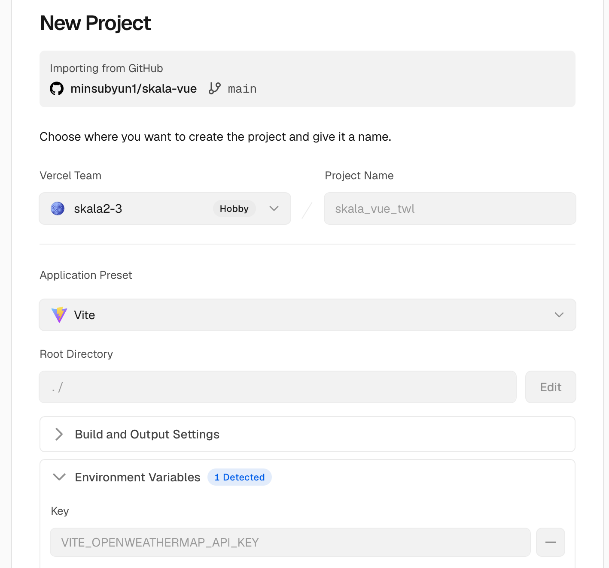
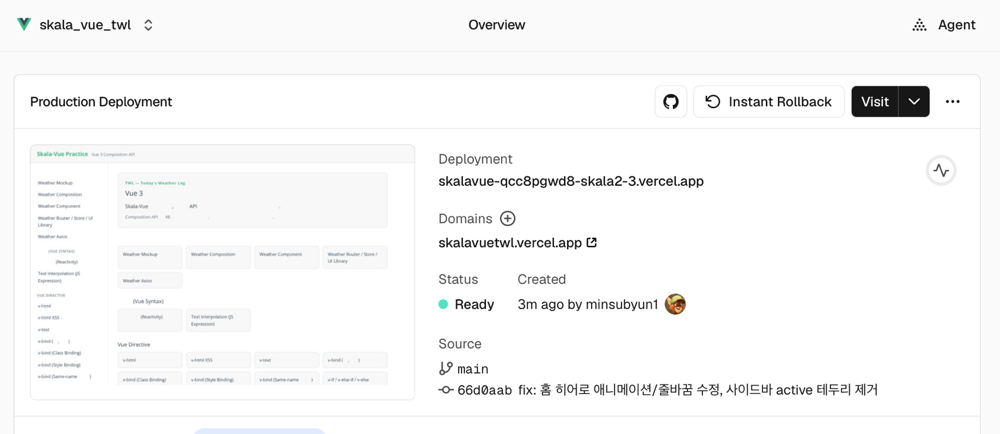

# 핸즈온 8 - Weather Deployment

[← README로 돌아가기](../README.md)

배포 주소: https://skalavuetwl.vercel.app

## 과제 요구사항

▪ Source Code 품질관리
1. ESLint로 점검하여 제출 과제의 Error를 없도록 한다.
2. API 키는 환경 변수로 조정하고 Git에 업로드 되지 않도록 한다.

▪ Build & Deployment
1. Project를 Build 한다.
2. Build 된 정적파일들을 본인의 서버에 Hosting 한 후 확인한다.

## 1. ESLint 점검

`npm run lint`(oxlint + eslint)는 핸즈온을 하나씩 진행할 때마다 매번 돌려서 0 error 상태를 유지해왔습니다. 배포 직전에 다시 한번 전체를 돌려서 확인했고, 별도로 `npm run format`(Prettier)도 돌려서 28개 파일에 쌓여있던 포맷 차이(줄바꿈 스타일 등, 로직 변경 없음)까지 정리했습니다.

## 2. API 키 환경 변수 처리

OpenWeatherMap API 키는 핸즈온 6에서부터 `.env.local`에만 넣어뒀고, `.gitignore`의 `*.local` 규칙에 걸려서 처음부터 git에 올라간 적이 없습니다.

```
# .env.example (실제 값 없이 커밋되는 템플릿)
VITE_OPENWEATHERMAP_API_KEY=your_openweathermap_api_key_here
```

배포 환경에서는 로컬 `.env.local` 파일이 통째로 서버에 올라가지 않기 때문에, Vercel 프로젝트 설정의 Environment Variables에 같은 키를 직접 등록해야 합니다.

<table>
<tr>
<td width="50%"></td>
<td width="50%"></td>
</tr>
</table>

New Project 화면에서 GitHub 저장소(`minsubyun1/skala-vue`)를 Import하면 Framework Preset은 Vite로 자동 감지되고, Environment Variables 항목에 `.env.local`과 똑같은 키 이름(`VITE_OPENWEATHERMAP_API_KEY`)을 등록한 뒤 Deploy를 눌렀습니다. 프로젝트 이름은 핸즈온 6~7에서 정한 브랜드(TWL — Today's Weather Log)에 맞춰 `skala_vue_twl`로 지었고, 최종 도메인은 `skalavuetwl.vercel.app`입니다.

## 3. Build

```
npm run build
```

`dist/` 폴더에 라우트별로 쪼개진 JS 청크(예: `WeatherAxiosView-[hash].js`)와 정적 리소스가 생성되는 걸 확인했습니다. 이 청크 분리는 Vue Router의 Lazy Loading(`() => import(...)`)을 핸즈온 4부터 계속 써온 결과입니다 — 방문한 페이지의 코드만 그때그때 받아옵니다.

## 4. Hosting - Vercel

GitHub 저장소만 연결하면 push할 때마다 자동으로 재빌드/재배포되는 구조라 선택했습니다. Build Command(`npm run build`)와 Output Directory(`dist`)는 Vite 프리셋이 자동으로 잡아줘서 따로 손댈 게 없었습니다.

### 트러블슈팅 - 서브 경로 새로고침 시 404

배포 직후에 `/handson/weather-router`처럼 홈이 아닌 경로를 새로고침하면 404가 떴습니다. 이 프로젝트는 Vue Router를 `createWebHistory`(해시 없는 방식)로 쓰는데, Vercel은 기본적으로 요청받은 경로와 정확히 일치하는 정적 파일이 없으면 그냥 404를 내려줍니다. `/handson/weather-router`라는 실제 파일은 없고 그 경로 처리는 브라우저에 로드된 `index.html`의 Vue Router가 담당하기 때문에, 모든 경로 요청을 `index.html`로 돌려보내는 리라이트 규칙이 필요했습니다.

```json
// vercel.json
{
  "rewrites": [{ "source": "/(.*)", "destination": "/index.html" }]
}
```

이 파일을 추가하고 다시 push하니 재배포되면서 바로 해결됐습니다.

## 검증

- `curl`로 `/`, `/handson/weather-router`, `/handson/weather-axios` 세 경로 모두 200 응답 확인 (수정 전에는 뒤 두 개가 404였음)
- 배포된 사이트에서 Weather Axios 페이지에 "Seoul"을 검색해서 실제 온도(33°C)가 정상적으로 나오는 것까지 확인 — Environment Variables에 등록한 키가 프로덕션 빌드에도 제대로 주입됐다는 뜻입니다
- 콘솔/페이지 에러 없음 확인
